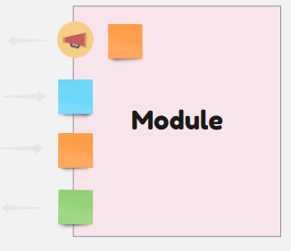

[](https://www.nuget.org/packages/Fiffi/)


# Fiffi

Exploration kit for event driven services. Fiffi is a framework for code feedback of modeling. It forces some contracts on your infrastructure AND domain.

> Core is the Fiffi IEvent envelope, EventRecord, ICommand, IQuery. Infrastructure is IAdvancedEventStore and ISnapshopStore.

## Testing

<pre>
┏━━━━━━━━━━━━━━━━━┳━━━━━━━━━━━━━━━━━━━━━━━━━━━━━━━━━━━━━━━━━━━━━━━━━━━━━━━━━━━━━━━━━━━┳━━━━━━┳━━━━━━━━━━━━━━━━━━┓
┃ Flow            ┃ Waterfall                                                         ┃ Time ┃ Aggregate        ┃
┣━━━━━━━━━━━━━━━━━╋━━━━━━━━━━━━━━━━━━━━━━━━━━━━━━━━━━━━━━━━━━━━━━━━━━━━━━━━━━━━━━━━━━━╋━━━━━━╋━━━━━━━━━━━━━━━━━━┫
┃ FooCommand      ┃ ▓▓▓▓▓▓▓▓▓▓▓▓▓▓▓░░░░░░░░░░░░░░░░░░░░░░░░░░░░░░░░░░░░░░░░░░░░░      ┃ 0    ┃ 99a9c841-ebd9-4d ┃
┃ FooEvent        ┃ ░░░░░░░░░░░░░░░▓▓▓▓▓▓▓▓▓▓▓▓▓▓▓░░░░░░░░░░░░░░░░░░░░░░░░░░░░░░      ┃ 1    ┃ 99a9c841-ebd9-4d ┃
┃ FooEvent        ┃ ░░░░░░░░░░░░░░░▓▓▓▓▓▓▓▓▓▓▓▓▓▓▓░░░░░░░░░░░░░░░░░░░░░░░░░░░░░░      ┃ 1    ┃ 4cbcde1d-f12d-42 ┃
┃ BarCommand      ┃ ░░░░░░░░░░░░░░░░░░░░░░░░░░░░░░▓▓▓▓▓▓▓▓▓▓▓▓▓▓▓░░░░░░░░░░░░░░░      ┃ 2    ┃ 5800daa3-a109-4d ┃
┃ BarEvent        ┃ ░░░░░░░░░░░░░░░░░░░░░░░░░░░░░░░░░░░░░░░░░░░░░▓▓▓▓▓▓▓▓▓▓▓▓▓▓▓      ┃ 3    ┃ 5800daa3-a109-4d ┃
┃ BarEvent        ┃ ░░░░░░░░░░░░░░░░░░░░░░░░░░░░░░░░░░░░░░░░░░░░░▓▓▓▓▓▓▓▓▓▓▓▓▓▓▓      ┃ 3    ┃ a5c155cb-3f2d-4a ┃
┃ BarCommand      ┃ ░░░░░░░░░░░░░░░░░░░░░░░░░░░░░░▓▓▓▓▓▓▓▓▓▓▓▓▓▓▓░░░░░░░░░░░░░░░      ┃ 2    ┃ f20ba848-44f1-45 ┃
┃ BarEvent        ┃ ░░░░░░░░░░░░░░░░░░░░░░░░░░░░░░░░░░░░░░░░░░░░░▓▓▓▓▓▓▓▓▓▓▓▓▓▓▓      ┃ 3    ┃ f20ba848-44f1-45 ┃
┃ BarEvent        ┃ ░░░░░░░░░░░░░░░░░░░░░░░░░░░░░░░░░░░░░░░░░░░░░▓▓▓▓▓▓▓▓▓▓▓▓▓▓▓      ┃ 3    ┃ 21e1360f-13af-45 ┃
┗━━━━━━━━━━━━━━━━━┻━━━━━━━━━━━━━━━━━━━━━━━━━━━━━━━━━━━━━━━━━━━━━━━━━━━━━━━━━━━━━━━━━━━┻━━━━━━┻━━━━━━━━━━━━━━━━━━┛
</pre>

       [Fact]
        public async Task CreateGame()
        {
            //Given
            context.Given(Array.Empty<IEvent>());

            //When
            await context.WhenAsync(new CreateGame { FirstTo = 3, GameId = Guid.NewGuid(), PlayerId = "tester", Title = "Test Game" });

            //Then  
            context.Then((events, visual) => {
                this.helper.WriteLine(visual);
                Assert.True(events.OfType<GameCreated>().Happened());
            });
        }

At it's core is an definition of an IEventStore and the IEvent.

```
	public interface IEventStore
	{
		Task<long> AppendToStreamAsync(string streamName, long version, IEvent[] events);

		Task<(IEnumerable<IEvent> Events, long Version)> LoadEventStreamAsync(string streamName, int version);
	}
```

The kit then focuses on creating a module of use cases with event driven state and flows.

The ApplicationService.ExecuteAsync is targeted on the infrastructure part of an application service.

```
ApplicationService.ExecuteAsync(
					store,
					command,
					state => Array.Empty<IEvent>(),
					events => pub(events)
					)
```

The core Fiffi project also includes tools for handling command, query, event dispatching/routing, meta data and concurrency options.

The vision is to create a kit to get feedback/test from modeling/event storming sessions.


## Modules

Using the Fiffi TestContext is based on using Modules. A boundary with a facade accepting commands, events and queries, it also publishes events - a key part of testing. 



## Testing With Modules

The first option would be using the configuration builder.

```
public class TestModule : Module
{
    public TestModule(ModuleCore core) : base(core)
    { }

    public static TestModule Initialize(IAdvancedEventStore store, ISnapshotStore snapshotStore, Func<IEvent[], Task> pub)
        => new Configuration<TestModule>(x => new TestModule(x))
        .Commands(cmd => store.ExecuteAsync(cmd, "test", () => new[] { new TestEventRecord("test") }, pub))
        .Updates(events => snapshotStore.Apply("test", new TestView(0), events.Select(x => x.Event), Apply))
        .Triggers((events, dispatcher) => Task.CompletedTask)
        .Query<TestQuery, TestView?>(q => snapshotStore.Get<TestView>("test"))
        .Create(store);

    public record TestView(int EventCount) : View;

    public static TestView Apply(
        TestView snap,
        EventRecord @event) => snap with { EventCount = snap.EventCount + 1 };

    public record TestQuery() : IQuery<TestView?>;
}
```

### Creating a TestContext for integration tests

Using the *TestModule* we use the *TestHost* and *TextContext*, constructed by an extension.

```
(host, context) = Host.CreateDefaultBuilder()
            .ConfigureWebHostDefaults(webBuilder =>
                webBuilder.ConfigureServices(services =>
                services
                .AddFiffiInMemory()
                .AddModule(TestModule.Initialize)
                .AddInMemoryEventSubscribers()
                )
                .Configure(app => app.UseWelcomePage()))
            .CreateFiffiTestContext(TestModule.Initialize);
```

In a "real" scenario the services configuration would be in Program or equivalent, so we could user the *IHostBuilder*. The replacement of Fiffi infrastructure would also be done via test services.

```
 .CreateFiffiTestContext(
                testServices => testServices.AddFiffiInMemory(), 
                TestModule.Initialize);
```

> The Fiffi *CreateFiffiTestContext* **replaces** the subject module and event subscribers (with a test spy and additional test modules). 


Armed with the *host* and *context* we could start authoring a simple test.

```
    [Fact]
    public async Task SimpleEventCaptureAsync()
    {
        await host.StartAsync();

        await context.WhenAsync(new TestCommand(new AggregateId("test")));

        context.Then((events, visual) => Assert.True(events.Happened<TestEventRecord>()));
        await context.ThenAsync(new TestModule.TestQuery(), result => Assert.Equal(1, result.EventCount));
    }
```

The *TestContext* offers a Given, When, Then (GWT) approach to interact with the subject module (and additional modules). A visualization extension also offers a ascii timeline, that you could output via your test framework.

The GWT approach also lets us build a current state by a history of events, by building event envelopes for testing. 

```
    [Fact]
    public async Task HistoryEventCaptureAsync()
    {
        await host.StartAsync();

        context.Given(EventEnvelope //todo extension
            .Create("test", new TestEventRecord("test"))
            .AddTestMetaData("test"));

        await context.WhenAsync(new TestCommand(new AggregateId("test")));

        context.Then((events, visual) => Assert.True(events.Happened<TestEventRecord>()));
        await context.ThenAsync(new TestModule.TestQuery(), result => Assert.Equal(2, result.EventCount));
    }
```
> The *TestContext* will apply the history of events to the configured event store and projections, based on stream meta data and module configuration.

### Alternative way of authoring modules

An alternative to the more functional builder describe above, is to implement the *IModule* interface.

```
public class TestInterfaceModule : IModule
{
    readonly IAdvancedEventStore store;
    readonly ISnapshotStore snapshotStore;
    readonly Func<IEvent[], Task> pub;

    public TestInterfaceModule(IAdvancedEventStore store, ISnapshotStore snapshotStore, Func<IEvent[], Task> pub)
    {
        this.store = store;
        this.snapshotStore = snapshotStore;
        this.pub = pub;
    }

    public Task DispatchAsync(ICommand command) =>
         store.ExecuteAsync(command, "test", () => new[] { new TestEventRecord("test") }, pub);

    public Task OnStart(IEvent[] events) => WhenAsync(events);

    public async Task<T?> QueryAsync<T>(IQuery<T> q) where T : class
     => await (q switch
     {
         TestQuery => snapshotStore.Get<T>("test"),
         _ => throw new InvalidOperationException()
     });

    public IAsyncEnumerable<T> QueryAsync<T>(IStreamQuery<T> q)
     => throw new NotImplementedException();

    public Task WhenAsync(params IEvent[] events) =>
        snapshotStore.Apply("test", new TestView(0), events.Select(x => x.Event), Apply);
}
```

> Note that there is no Update or Trigger methods in *IModule*. In the builder version a few thing are done under the hood, to aid startup and run updates before triggers. In the *IModule* version you handle *OnStart* and *WhenAsync* your self. 